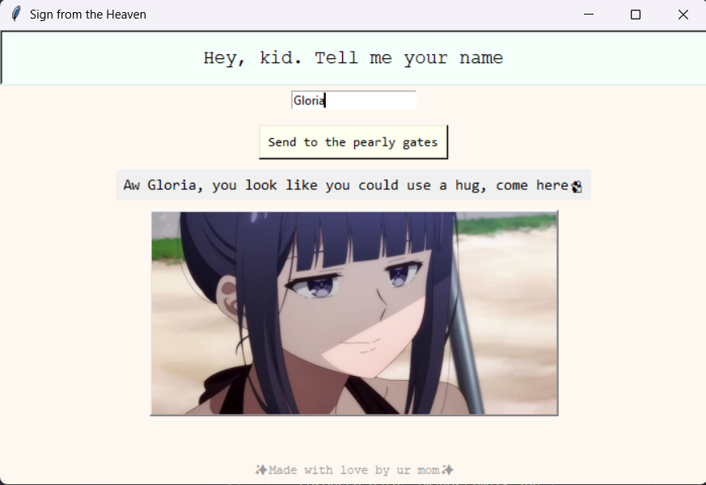
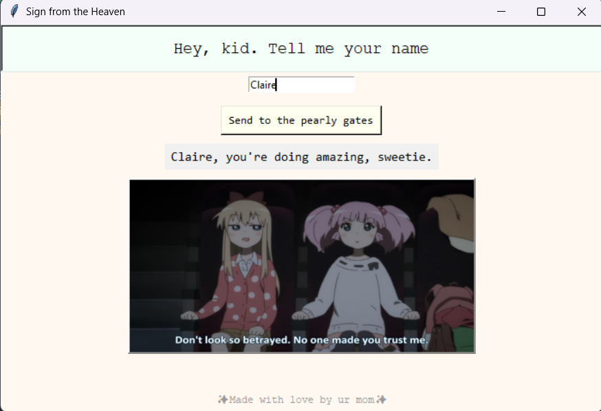

# ✨ Sign From Above ✨

→ [Download the .exe (Windows)] (https://github.com/harshitamudgal/Get-a-silly-message/releases/tag/v1.0)

---

## 🛠️ Built While Learning Tkinter

So here’s the deal: I didn’t plan this. I was learning `tkinter`, trying to get my head around GUI stuff, and thought:

> “What if I just… asked the user their name and greeted them?”

Then:

→ “Wait. What if the greeting was... **random**?”  
→ “what if it also showed a cute **image**?”  
→ “LET’S RANDOMIZE THE IMAGE TOO" 😭

...And boom 💥 it was `Sign From Above`.

This isn’t solving world hunger. It’s not changing lives or whatever. But I do it for the vibes!  
**peak vibe-coding™. Just me having fun with tech.**

---

## 💻 What the App Does

Once you run it, the app:

- Asks for your name
- Greets you with a ✨chaotic✨ message (see for yourself)
- Shows a random feel-good(or not so feel-good) image
- Encourages being delulu and drinking water

You can hit Enter or click the button. You’ll get a new random message + image every time.

> This is what I do at 2 a.m💅

---

## 🚀 How to Run It Locally 

If you want to run the `.py` version instead of the `.exe`:

1. **Clone the repo**  
```bash
git clone https://github.com/YOUR_USERNAME/sign-from-above.git
cd sign-from-above
```
2. **Install required packages**
```bash
pip install pillow
```
3. **Run it**
```bash
python sign-from-above.py
```

---
 ##  ⚠️ Getting the “Windows protected your PC” warning? 

 That’s just Windows Defender being a little dramatic.
 The `.exe` is **not digitally signed**, which basically means:
"This wasn’t made by a Verified Developer™ in a corporate bunker somewhere."

 Here's what to do:
 - Click **"More info" → "Run anyway"** — it’s safe, I promise.

---
## Screenshots 'cause why not ##



